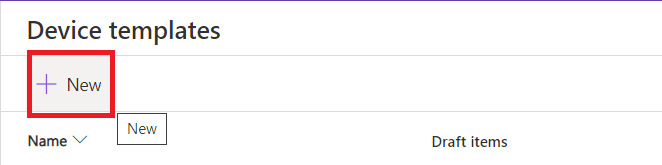
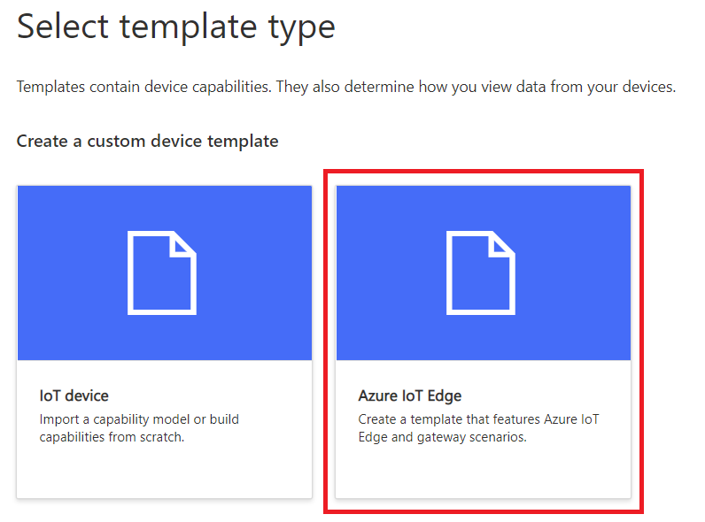

# Model and Connect Azure IoT Edge devices to an Azure IoT Central application

Download the IoT Edge manifest file from GitHub. Right-click on the following link and then select **Save link as**: [centraledgetemplate.json](centraledgetemplate.json)

## Create device template

In this section, you create a device template for an IoT Edge device that connects to your IoT Central application. You import an IoT Edge manifest to get started, and then modify the template to add relationship to the downstream device:

### Import manifest to create template

To create a device template from an IoT Edge manifest:

1. In your IoT Central application, navigate to **Device templates** and select **+ New**.

    

1. On the **Select template type** page, select the **Azure IoT Edge** tile. Then select **Next: Customize**.

    

1. On the **Upload an Azure IoT Edge deployment manifest** page, enbale checkbox **Gateway device with downstream devices** and select **Browse** to upload the **centraledgetemplate.json** you downloaded previously. Then select **Next: Review**.

    

1. On the **Review** page, select **Create**.

1. When the template has been created, change its name to *EdgeGatewayModel*.

    

1. Before we publish the edge gateway model, we need to step the relationship for the downstream device. For the downstream device, we need to create a new device model. Navigate to **Device templates** and select **+ New**

    

1. On the **Select template type** page, select the **IoT device** tile. 

    

1. From the **Use a preconfigured device template** section, select **RS40 Occupancy Sensor**. Then select **Next: Review**.

    

1. On the **Review** page, select **Create**.

1. Navigate to **Device templates** and you will see two models. 

    

1. Click on the **EdgeGatewayModel** and click **Relationships**

    

1. Click on the **Add relationship** and enter the **Display name**, **Name** details. Select **RS40 Occupancy Sensor** from the **Target** dropdown. Click Save.

    

### Publish the template

Before you can add a device that uses the **EdgeGatewayModel** template, you must publish the template.

Navigate to the **EdgeGatewayModel** template and select **Publish**. Then select **Publish** to publish the template:


## Add IoT Edge device

Now you've published the **EdgeGatewayModel** template, you can add a device to your IoT Central application:

1. In your IoT Central application, navigate to the **Devices** page and select **EdgeGatewayModel** in the list of available templates.

1. Select **+** to add a new device from the template. On the **Create new device** page, select **Create**.

    

You now have a new device with the status **Registered**:


### Get the device credentials

When you deploy the IoT Edge device later in this tutorial, you need the credentials that allow the device to connect to your IoT Central application. The get the device credentials:

1. On the **Device** page, select the device you created.

1. Select **Connect**.

1. On the **Device connection** page, make a note of the **ID Scope**, the **Device ID**, and the **Primary Key**. You use these values later.

1. Select **Close**.

You've now finished configuring your IoT Central application to enable an IoT Edge device to connect.

## Provision VM as an IoT Edge device 

To provision VM as an IoT Edge device:

1. Go back to Azure Portal select the VM you provisioned. In the **Support + troubleshooting** section, select **Serial console**.

1. Press **Enter** to see the `login:` prompt. Enter your username and password to sign in.

1. Run the following command to check the IoT Edge runtime version. At the time of writing, the version is 1.0.8:

    ```bash
    sudo iotedge --version
    ```

1. Use the `nano` editor to open the IoT Edge config.yaml file:

    ```bash
    sudo nano /etc/iotedge/config.yaml
    ```

1. Scroll down until you see `# Manual provisioning configuration`. Comment out the next three lines as shown in the following snippet:

    ```yaml
    # Manual provisioning configuration
    #provisioning:
    #  source: "manual"
    #  device_connection_string: "<ADD DEVICE CONNECTION STRING HERE>"
    ```

1. Scroll down until you see `# DPS symmetric key provisioning configuration`. Uncomment the next eight lines as shown in the following snippet:

    ```yaml
    # DPS symmetric key provisioning configuration
    provisioning:
      source: "dps"
      global_endpoint: "https://global.azure-devices-provisioning.net"
      scope_id: "{scope_id}"
      attestation:
        method: "symmetric_key"
        registration_id: "{registration_id}"
        symmetric_key: "{symmetric_key}"
    ```

1. Replace `{scope_id}` with the **ID Scope** for you made a note of previously.

1. Replace `{registration_id}` with the **Device ID** you made a note of previously.

1. Replace `{symmetric_key}` with the **Primary key** you made a note of previously.

1. Save the changes (**Ctrl-O**) and exit (**Ctrl-X**) the `nano` editor.

    


1. Run the following command to restart the IoT Edge daemon:

    ```bash
    sudo systemctl restart iotedge
    ```

1. To check the status of the IoT Edge modules, run the following command:

    ```bash
    iotedge list
    ```

    The output looks like the following:

    ```bash
    NAME                        STATUS           DESCRIPTION      CONFIG
    edgeAgent                   running          Up 27 seconds    mcr.microsoft.com/azureiotedge-agent:1.0.9
    edgeHub                     running          Up 22 seconds    mcr.microsoft.com/azureiotedge-hub:1.0.9
    ```

## Fill the Form (Cloud Properties)

The simulated IoT Edge device is now running in the VM. In your IoT Central application, the device status is now **Provisioned** on the **Devices** page:


Enter Cloud Properties for your Device and Click **Save**: 


## View the telemetry

You can see the telemetry on the **View IoT Edge device telemetry** page:


The **Modules** page shows the status of the IoT Edge modules:


## Set Module Twin Properties

You can set twin properties on the **Simulated Temperature Modlule** to stop sending data, module will react to the cloud update:

Uncheck **SendData** property and Click **Save**


Type the following command in the Linux VM to view logs
    ```bash
    iotedge logs -f SimulatedTemperatureSensor
    ```

You will see that the module stops sending data


Check the **SendData** check box and Click **Save**. Module will start sending data again 


Type the following command in the Linux VM to view logs
    ```bash
    iotedge logs -f SimulatedTemperatureSensor
    ```

You will see that the module stops sending data


